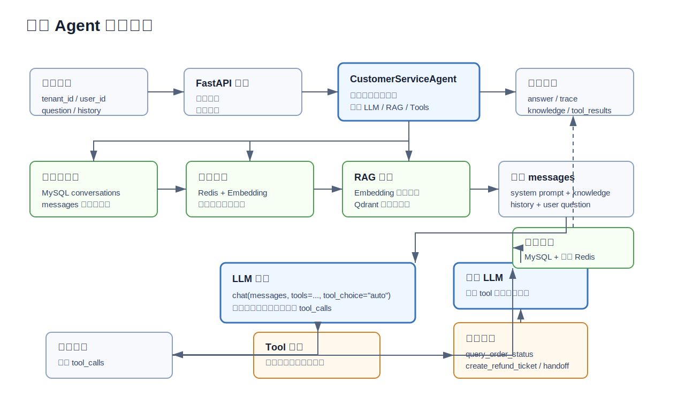

# Enterprise Customer Service Agent

一个面向企业售后客服场景的 AI Agent 后端练习项目。

在系统学习 Python、FastAPI、LLM 应用开发、RAG 和 Function Calling 之后整理的个人练习项目。项目目标不是做一个简单的聊天样例，而是把智能客服常见链路拆成可运行、可测试、可扩展的后端工程，便于继续学习和复盘。

> 项目定位：个人学习项目。代码采用生产化分层结构和真实外部依赖接入方式，但不等同于已经上线的商业系统。

## Features

- FastAPI 提供 HTTP API、Swagger 文档和 SSE 事件流接口。
- OpenAI-compatible LLM 接入大模型服务。
- Qdrant 作为知识库向量检索引擎。
- Redis 作为语义缓存存储。
- MySQL 保存会话、消息、订单和售后工单。
- Function Calling 支持订单查询、退款工单、转人工等业务动作。
- 高风险工具默认需要确认，避免模型直接执行退款、转人工等写操作。
- 用户问题进入 RAG/LLM 前会做轻量标准化和意图标签识别。
- RAG 支持知识库检索后再组织上下文回答。
- 验证台用于本地测试客服问答、工具调用和 RAG 证据。
- Docker Compose 提供 MySQL、Redis、Qdrant 依赖。
- GitHub Actions 执行基础测试和代码检查。

## Architecture



## Tech Stack

- Python 3.11+
- FastAPI
- Pydantic v2
- SQLAlchemy 2.x Async ORM
- MySQL
- Redis
- Qdrant
- OpenAI-compatible Chat Completions API
- OpenAI-compatible Embeddings API or Ollama Embeddings
- pytest
- ruff

## Project Structure

```text
enterprise-customer-service-agent/
  Dockerfile
  docker-compose.yml
  pyproject.toml
  requirements.txt
  sample_knowledge/
    售后政策.md
    物流与订单.md
  scripts/
    check_env.py          # 检查运行配置，不打印密钥
    init_db.py            # 初始化数据库表
    seed_demo_data.py     # 写入演示订单
    ingest_docs.py        # 导入知识库到 Qdrant
    run_dev.py            # 启动本地 FastAPI 服务
  src/customer_service_app/
    api/                  # FastAPI 路由
    core/                 # 配置、异常、日志、中间件、安全
    domain/               # 请求响应 DTO
    infrastructure/       # LLM、Embedding、DB、Redis、Qdrant、Search
    prompts/              # 系统提示词
    services/             # 业务编排
    tools/                # Function Calling 工具
    workflows/            # LangGraph 扩展入口
  tests/
```

## Configuration

复制配置模板：

```bash
cp .env.example .env
```

常用配置项：

```dotenv
LLM_API_KEY=
LLM_BASE_URL=
LLM_MODEL=

EMBEDDING_PROVIDER=openai_compatible
EMBEDDING_API_KEY=
EMBEDDING_BASE_URL=
EMBEDDING_MODEL=
EMBEDDING_DIMENSION=1024

DATABASE_URL=mysql+aiomysql://customer_service:customer_service@**:3306/customer_service?charset=utf8mb4
REDIS_URL=redis://**:6380/0
QDRANT_URL=http://**:6333
QDRANT_COLLECTION=customer_service_knowledge
```

安全说明：
- `.env.example` 只保留空值和示例配置。
- `JWT_SECRET_KEY` 本地调试可以留空；如果改造成对外服务，需要配置强随机密钥并接入认证。

## Quick Start

创建虚拟环境、安装依赖并准备配置：

```bash
python3.11 -m venv .venv
source .venv/bin/activate
pip install -r requirements.txt
cp .env.example .env
```

启动本地依赖：

```bash
docker compose up -d mysql redis qdrant
```

检查配置：

```bash
python scripts/check_env.py
```

初始化数据库并写入演示订单：

```bash
python scripts/init_db.py
python scripts/seed_demo_data.py
```

导入样例知识库：

```bash
python scripts/ingest_docs.py sample_knowledge --tenant-id default
```

访问地址：

- API Docs: <https://www.bottlecz.cn/docs>
- Ops Console: <https://www.bottlecz.cn/ops>
- Health Check: <https://www.bottlecz.cn/health/ready>

## Example Requests

政策问答：

```text
你好，我想了解一下七天无理由退货政策。
```

订单查询：

```text
我的订单 202606040001 到哪里了？
```

退款工单：

```text
我的订单 202606040001 已经签收了，但我想申请退款。
```

转人工：

```text
这个问题我需要人工客服处理。
```

## API Example

```bash
curl -X POST "https://www.bottlecz.cn/api/v1/chat" \
  -H "Content-Type: application/json" \
  -d '{
    "tenant_id": "default",
    "user_id": "u001",
    "conversation_id": null,
    "question": "我的订单 202606040001 到哪里了？",
    "history": [],
    "metadata": {}
  }'
```

## Tests

```bash
pytest -q
ruff check src tests scripts
```

## Current Scope

当前版本重点覆盖“智能客服后端最小闭环”：

- 用户问题进入 API。
- 会话和消息落库。
- RAG 检索售后知识。
- LLM 根据上下文回答或决定调用工具。
- 后端执行订单查询；退款、转人工等高风险工具默认先返回确认提示。
- 返回 answer、knowledge、tool_results 和 trace。

暂未包含完整生产级能力，例如高风险人工审批流、长短期记忆压缩、完整 LangGraph 多节点状态机、完善评测集和权限体系。这些内容放在 Roadmap 中继续迭代。

## Roadmap

- 增加独立确认接口和审批状态表，承接当前高风险工具确认保护。
- 增加短期记忆压缩和长期用户记忆。
- 增加 LangGraph 多节点编排，替换当前顺序式 Agent 主流程。
- 增加更完整的 RAG 评测集和回归测试。

## License

MIT
